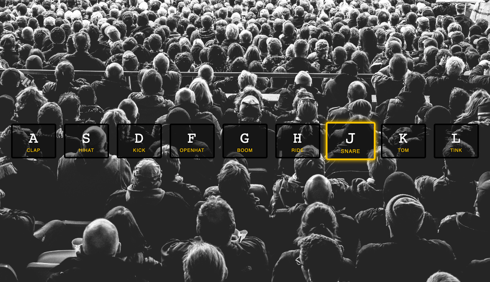

JavaScript Drum Kit
===


```javascript
function playSound(e) {
    const audio = document.querySelector(`audio[data-key="${e.keyCode}"]`);
    const key = document.querySelector(`.key[data-key="${e.keyCode}"]`);
    if(!audio) return;
    
    audio.currentTime = 0;
    audio.play();
    key.classList.add('playing')
};
```
1. 定義 `playSound` 函數：
    - 當鍵盤按鍵被按下時，這個函數會被觸發。
    - 函數首先通過 `document.querySelector` 方法尋找與被按下的按鍵相對應的 `<audio>` 標籤和 `.key` 元素。這是通過比較 `data-key` 屬性和鍵盤事件的 `keyCode` 屬性來實現的。
    - 如果沒有找到對應的 `<audio>` 標籤（即 `audio` 變量為空），則函數返回，不進行任何操作。
    - 將 `audio` 元素的 `currentTime` 屬性設為 0，這樣每次按鍵被按下時音效都會從頭開始播放。
    - 播放音效。
    - 給對應的 `.key` 元素添加 `playing` 這個類，這通常會觸發一些 CSS 過渡或動畫效果。
---

```javascript
function removeTransition(e) {
    if(e.propertyName !== 'transform') return; 
    console.log(e.propertyName); 
    this.classList.remove('playing');
};
```
2. 定義 `removeTransition` 函數：
    - 這個函數用於在 CSS 過渡結束後執行，將 `playing` 類從元素上移除。
    - 函數首先檢查觸發過渡結束事件的 CSS 屬性是否是 `transform`。如果不是，則函數返回，不進行任何操作。
    - 使用 `console.log` 打印出觸發過渡結束的 CSS 屬性名。
    - 從元素上移除 `playing` 類。
---

3. 為所有 `.key` 元素添加過渡結束監聽器：
    - 首先通過 `document.querySelectorAll` 選擇所有的 `.key` 元素。
    - 使用 `forEach` 方法遍歷這些元素，為每一個添加一個事件監聽器，當 CSS 過渡結束時執行 `removeTransition` 函數。

4. 為 `window` 對象添加鍵盤按下的監聽器：
    - 當鍵盤按鍵被按下時，執行 `playSound` 函數。